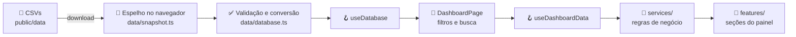

# Monitoramento de Inadimplência

Painel web para **análise da carteira de cobrança**. Ele mostra quanto está em atraso, há quanto tempo, com quem está concentrada a dívida e quais clientes precisam de atenção primeiro.

> 🔗 **Acesse o painel:** _[adicione aqui o link da Vercel]_
>
> ⚠️ Todos os dados deste projeto são **fictícios** e servem apenas para demonstração.

<!--
  Dica: adicione uma captura de tela do painel em docs/imagens/painel.png
  e troque este comentário por:
  
-->

---

## Sumário

- [Funcionalidades](#funcionalidades)
- [Tecnologias](#tecnologias)
- [Como rodar o projeto](#como-rodar-o-projeto)
- [Estrutura de pastas](#estrutura-de-pastas)
- [Como os dados chegam à tela](#como-os-dados-chegam-à-tela)
- [Atualizando a base de dados](#atualizando-a-base-de-dados)
- [Publicando na Vercel](#publicando-na-vercel)
- [Documentação complementar](#documentação-complementar)
- [Autor](#autor)

---

## Funcionalidades

| Seção | O que mostra |
|---|---|
| **Distribuição de atraso** | Saldo vencido dividido em faixas: 01–29, 30–60, 61–90 e 91+ dias |
| **Indicadores (KPIs)** | Percentual recuperado no ano, atraso médio, clientes em aberto e ticket médio, com comparação ao período anterior |
| **Entrada mensal** | Gráfico de recebido x em aberto por mês, com a linha da taxa de recuperação e uma frase de destaque gerada a partir dos números |
| **Concentração · Top 10** | Os 10 clientes e os 10 empreendimentos com maior saldo vencido e o risco de concentração da carteira |
| **Fila de cobrança** | Todos os clientes com saldo vencido, do maior para o menor, com o selo **"piorou"** para quem se agravou no último mês |
| **Detalhes do cliente** | Gaveta lateral com saldo, **valor atualizado** (com correção, multa e juros), documentos em aberto e histórico de pagamentos |

Além disso:

- **Filtros** por ano, coligada e tipo de cobrança, na barra do topo (desktop) ou num painel próprio (celular e botão flutuante).
- **Busca** por nome do cliente ou número de documento, sem diferenciar acentos e maiúsculas. Ela filtra o painel inteiro.
- **Botão "Atualizar" no estilo Power BI:** o painel abre com a cópia da última atualização e só busca dados novos quando o usuário clica em "Atualizar".
- **Layout responsivo**, pensado para desktop e celular.

---

## Tecnologias

| Tecnologia | Para que é usada |
|---|---|
| [React 19](https://react.dev/) | Biblioteca para construir a interface em componentes |
| [TypeScript](https://www.typescriptlang.org/) | JavaScript com tipos, para evitar erros e deixar o código autoexplicativo |
| [Vite 8](https://vite.dev/) | Servidor de desenvolvimento e geração da versão de produção |
| [Tailwind CSS 4](https://tailwindcss.com/) | Estilização com classes utilitárias direto no JSX |
| [pnpm](https://pnpm.io/) | Gerenciador de pacotes (instala as dependências) |

O projeto **não tem backend nem banco de dados externo**. A base de dados é formada por arquivos CSV publicados junto com o site, e todos os cálculos são feitos no navegador.

---

## Como rodar o projeto

### Pré-requisitos

- [Node.js](https://nodejs.org/) **22** ou mais recente
- pnpm. Se ainda não tiver, ative com o comando abaixo, que já vem com o Node:

```bash
corepack enable
```

### Passo a passo

```bash
# 1. Instale as dependências
pnpm install

# 2. Inicie o servidor de desenvolvimento
pnpm dev
```

Abra **http://localhost:8443** no navegador. Ao salvar qualquer arquivo em `src/`, a página atualiza sozinha.

> Para testar no celular, use o endereço **Network** que aparece no terminal, com o celular conectado ao mesmo Wi-Fi.

### Comandos disponíveis

| Comando | O que faz |
|---|---|
| `pnpm dev` | Inicia o servidor de desenvolvimento em `localhost:8443` |
| `pnpm build` | Verifica os tipos e gera a versão de produção na pasta `dist/` |
| `pnpm preview` | Abre a versão de produção localmente, para conferir antes de publicar |
| `pnpm typecheck` | Só verifica os tipos do TypeScript, sem gerar arquivos |

---

## Estrutura de pastas

```
painel-cobranca/
├── public/
│   └── data/                    # 🗃️ Base de dados (CSVs) publicada junto com o site
├── src/
│   ├── main.tsx                 # Ponto de entrada: coloca o React na página
│   ├── App.tsx                  # Carrega os dados e decide: carregando, erro ou painel
│   ├── pages/
│   │   └── DashboardPage.tsx    # Monta a página do painel e guarda filtros e busca
│   ├── features/                # 🧩 Seções do painel, uma pasta por área
│   │   ├── aging/               #    Distribuição de atraso
│   │   ├── kpis/                #    Cartões de indicadores
│   │   ├── monthly-income/      #    Gráfico de entrada mensal
│   │   ├── concentration/       #    Ranking de concentração
│   │   ├── collection-queue/    #    Fila de cobrança e gaveta de detalhes
│   │   └── filters/             #    Barra, painel e botão de filtros
│   ├── components/              # 🧱 Peças reutilizáveis, sem regra de negócio
│   │   ├── feedback/            #    Telas de carregamento e erro
│   │   ├── icons/               #    Ícones
│   │   ├── layout/              #    Barra de navegação, cabeçalho, "voltar ao topo"
│   │   └── ui/                  #    Elementos visuais genéricos (ex.: selo de tendência)
│   ├── services/                # 🧮 Regras de negócio: todos os cálculos do painel
│   ├── hooks/                   # 🪝 Hooks do React (carregar dados, calcular seções...)
│   ├── data/                    # 📥 Leitura dos CSVs e "espelho" da última atualização
│   ├── config/
│   │   └── businessRules.ts     # ⚙️ Parâmetros do negócio (data-base, multa, juros...)
│   ├── types/                   # 🏷️ Tipos: tabelas da base e dados exibidos na tela
│   ├── utils/                   # 🔧 Funções auxiliares (datas, moeda, CSV, texto)
│   └── styles/
│       └── index.css            # Estilos globais, fontes e tema do Tailwind
├── docs/                        # 📚 Documentação complementar
├── index.html                   # Página HTML base (título, idioma, descrição)
├── package.json                 # Dependências e comandos
├── tsconfig.json                # Configuração do TypeScript
└── vite.config.ts               # Configuração do Vite
```

A ideia central é **separar responsabilidades**:

- **`services/`** sabe **calcular** e não sabe nada de tela.
- **`features/`** e **`components/`** sabem **desenhar** e não fazem contas: recebem os dados prontos.
- **`config/businessRules.ts`** concentra os **números do negócio**, para mudar uma regra sem caçar valores espalhados pelo código.

Mais detalhes em [docs/ARQUITETURA.md](docs/ARQUITETURA.md).

---

## Como os dados chegam à tela



1. Na **primeira visita**, o navegador baixa os CSVs e guarda uma cópia (o "espelho").
2. Nas **próximas visitas**, o painel abre direto com essa cópia e mostra quando ela foi atualizada.
3. Ao clicar em **"Atualizar"**, os CSVs mais recentes são baixados e substituem a cópia.
4. A cada mudança de filtro ou busca, os **services** recalculam as seções, e os componentes exibem o resultado.

---

## Atualizando a base de dados

1. Substitua os arquivos em [`public/data/`](public/data/), **mantendo os mesmos nomes e cabeçalhos das colunas**.
2. Publique a nova versão (veja abaixo) ou, localmente, recarregue a página.
3. No painel, clique em **"Atualizar"** para baixar os dados novos.

Se algum arquivo estiver com coluna faltando ou valor inválido, o painel mostra uma mensagem dizendo **qual arquivo e qual coluna** têm problema.

A descrição completa das tabelas está em [docs/BASE_DE_DADOS.md](docs/BASE_DE_DADOS.md).

---

## Publicando na Vercel

1. Envie o projeto para um repositório no GitHub. Ele pode ser **privado**.
2. Em [vercel.com](https://vercel.com/), clique em **Add New → Project** e importe o repositório.
3. A Vercel reconhece o Vite sozinha. Confira só estes campos:
   - **Build Command:** `pnpm build`
   - **Output Directory:** `dist`
4. Clique em **Deploy**.

Não é preciso configurar variáveis de ambiente. A cada novo envio para o GitHub, a Vercel publica a nova versão automaticamente.

---

## Documentação complementar

| Documento | Conteúdo |
|---|---|
| [docs/ARQUITETURA.md](docs/ARQUITETURA.md) | Camadas do projeto, convenções de código e como criar uma nova seção |
| [docs/REGRAS_DE_NEGOCIO.md](docs/REGRAS_DE_NEGOCIO.md) | Como cada número do painel é calculado, com exemplos |
| [docs/BASE_DE_DADOS.md](docs/BASE_DE_DADOS.md) | Tabelas, colunas, relacionamentos e formato dos CSVs |

---

## Autor

Desenvolvido por **[Seu nome]**.

- LinkedIn: [linkedin.com/in/seu-perfil](https://www.linkedin.com/in/seu-perfil)
- GitHub: [github.com/seu-usuario](https://github.com/seu-usuario)
