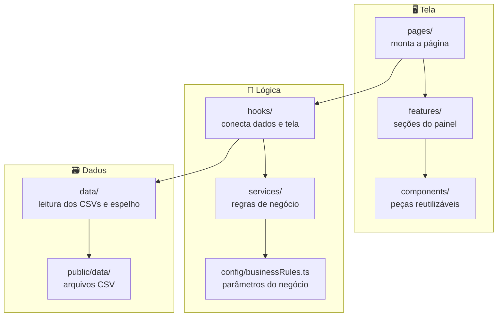

# Arquitetura do projeto

Este documento explica **como o código está organizado**, **por que** ele foi organizado assim e **como fazer mudanças** sem bagunçar a estrutura.

---

## Visão geral: as camadas

O projeto é dividido em camadas. Cada uma tem uma responsabilidade só e conversa apenas com as vizinhas.



| Camada | Pasta | Responsabilidade | O que **não** faz |
|---|---|---|---|
| Dados | `public/data/`, `src/data/` | Baixar, validar e converter os CSVs; guardar o espelho da última atualização | Cálculos de negócio |
| Regras de negócio | `src/services/`, `src/config/` | Calcular e formatar tudo o que o painel exibe | Nada de React ou HTML |
| Conexão | `src/hooks/` | Carregar a base, recalcular quando filtros e busca mudam | Cálculos detalhados (delegam aos services) |
| Página | `src/pages/` | Guardar o estado da página (filtros, busca) e posicionar as seções | Cálculos |
| Seções | `src/features/` | Desenhar cada área do painel com os dados recebidos | Buscar dados ou calcular |
| Peças genéricas | `src/components/` | Elementos visuais reaproveitáveis em qualquer tela | Conhecer regras do painel |

**Por que isso importa?** Se a regra do "valor atualizado" mudar, só `services/` e `config/` mudam. Se o visual de um cartão mudar, só `features/` muda. Cada mudança fica num lugar previsível.

---

## O caminho de um número até a tela

Exemplo: o total **"em aberto"** da Distribuição de Atraso.

1. **`public/data/fRecebimento.csv`**: a coluna `SALDO` de cada parcela.
2. **`src/data/snapshot.ts`**: baixa o arquivo, ou lê a cópia salva no navegador.
3. **`src/data/database.ts`**: `parseDatabase()` valida as colunas e converte cada linha num objeto `Recebimento`.
4. **`src/hooks/useDatabase.ts`**: entrega a base pronta para o `App`.
5. **`src/pages/DashboardPage.tsx`**: guarda os filtros e chama `useDashboardData`.
6. **`src/hooks/useDashboardData.ts`**: aplica filtros e busca e chama os services.
7. **`src/services/aging.ts`**: `buildAgingSummary()` soma o saldo vencido por faixa e formata como `"R$ 2,52 Mi"`.
8. **`src/features/aging/AgingDistributionCard.tsx`**: exibe o texto recebido via props.

---

## Pastas e arquivos

### `src/data/`: leitura dos dados

| Arquivo | Função |
|---|---|
| `database.ts` | Lista os arquivos CSV (`DATA_FILES`) e converte o texto em objetos tipados (`parseDatabase`). Lança erros claros para coluna ausente ou valor inválido. |
| `snapshot.ts` | Implementa o "espelho" no estilo Power BI: baixa os CSVs (`fetchLatestSnapshot`) e guarda e lê a cópia no navegador com IndexedDB (`saveSnapshot`, `loadSavedSnapshot`). |

### `src/services/`: regras de negócio

Funções **puras**: recebem dados e devolvem dados, sem React. Cada arquivo alimenta uma seção.

| Arquivo | Função |
|---|---|
| `calculations.ts` | Cálculos base de uma parcela: saldo vencido numa data, dias de atraso, faixa de atraso, valor atualizado |
| `filters.ts` | Opções dos filtros e aplicação de filtros e busca |
| `lookups.ts` | Busca de nomes (cliente, empreendimento) a partir dos códigos |
| `aging.ts` | Distribuição de atraso |
| `kpis.ts` | Indicadores e comparações |
| `monthlyIncome.ts` | Gráfico mensal e frase de destaque |
| `concentration.ts` | Rankings de concentração e risco |
| `collectionQueue.ts` | Fila de cobrança, selo "piorou" e dados da gaveta de detalhes |

Os services devolvem **dados já formatados para exibição**, como `"R$ 34.425"` e `"57,8%"`. Os tipos desses dados ficam em `src/types/dashboard.ts`.

### `src/hooks/`: conexão entre dados e tela

| Hook | Função |
|---|---|
| `useDatabase` | Carrega a base (espelho ou download), controla carregando, atualizando e erro, e oferece `refresh()` |
| `useDashboardData` | Recalcula todas as seções quando a base, os filtros ou a busca mudam (com `useMemo`) |
| `useIsVisible` | Diz se um elemento está visível na tela. Usado para mostrar o botão flutuante de filtros |

### `src/config/businessRules.ts`: parâmetros do negócio

Data-base, multa, juros, janela de comparação, tamanho do ranking, limites de risco e valor mínimo do selo "piorou". **Qualquer número de regra de negócio deve ficar aqui**, nunca escrito direto num componente ou service. Veja [REGRAS_DE_NEGOCIO.md](REGRAS_DE_NEGOCIO.md).

### `src/types/`: tipos

| Arquivo | Conteúdo |
|---|---|
| `database.ts` | Formato das tabelas originais (`Recebimento`, `Cliente`, `Coligada`...) |
| `dashboard.ts` | Formato dos dados que os componentes exibem (`Kpi`, `QueueRow`, `AgingSummary`...) |

### `src/utils/`: funções auxiliares

Pequenas funções genéricas, sem regra de negócio: `csv.ts` (leitura de CSV), `dates.ts` (datas), `formatters.ts` (moeda, número, percentual), `text.ts` (normalização para busca) e `array.ts` (soma).

---

## Convenções de código

### Nomes

| Tipo de arquivo | Padrão | Exemplo |
|---|---|---|
| Componente React | `PascalCase.tsx` | `ClientDetailsDrawer.tsx` |
| Hook | `useAlgo.ts` | `useDashboardData.ts` |
| Service, utilitário, config | `camelCase.ts` | `collectionQueue.ts` |
| Pasta de feature | `kebab-case` | `collection-queue/` |

- **Termos do negócio em português** (`Recebimento`, `parcela`, `saldo`, `dataVencimento`), porque espelham a base de dados e a linguagem da área de cobrança.
- **Termos técnicos em inglês** (`build`, `format`, `filter`, `row`), que é o padrão do ecossistema React.
- **Comentários e documentação em português.**

### Componentes

- Um componente por arquivo, com **exportação padrão** (`export default function ...`).
- Componentes de `features/` e `components/` **recebem dados via props** e não importam a base diretamente.
- Estado local só para comportamento visual, como aba selecionada ou menu aberto.

### Imports

Use o atalho `@/` para importar a partir de `src/`:

```ts
import { formatCurrency } from "@/utils/formatters";
```

Dentro da mesma feature, use caminho relativo: `import QueueTableRow from "./QueueTableRow";`

### Estilos

- **Tailwind CSS** direto no `className`. Não há arquivos CSS por componente.
- **Fontes** pelas classes do tema, definidas em `src/styles/index.css`:
  - `font-sans` (padrão): Plus Jakarta Sans
  - `font-display` (títulos): Inter
  - `font-urbanist` (subtítulos): Urbanist
- **Efeito de "atualizando":** marque textos com valores com a classe `data-text` e gráficos com `data-viz`. Enquanto os dados são atualizados, a página recebe `.is-refreshing` e esses elementos pulsam automaticamente.

### Strings

Use aspas duplas em textos com apóstrofo (`"it's"`), para não quebrar o build.

---

## Como criar uma nova seção no painel

Exemplo: um cartão **"Maiores atrasos"** com as 5 parcelas mais antigas.

1. **Tipo do dado exibido:** em `src/types/dashboard.ts`, crie o formato que o componente vai receber.

   ```ts
   export type OldestParcel = { client: string; document: string; days: string; value: string };
   ```

2. **Regra de negócio:** crie `src/services/oldestParcels.ts` com uma função pura que recebe as parcelas e devolve os dados formatados.

   ```ts
   export function buildOldestParcels(recebimentos: Recebimento[], lookups: Lookups): OldestParcel[] { ... }
   ```

   Se precisar de algum número configurável, como a quantidade 5, coloque-o em `src/config/businessRules.ts`.

3. **Cálculo junto com as outras seções:** em `src/hooks/useDashboardData.ts`, chame a função e inclua o resultado no retorno.

4. **Componente visual:** crie `src/features/oldest-parcels/OldestParcelsCard.tsx`, que recebe os dados via props e só exibe.

5. **Posição na página:** em `src/pages/DashboardPage.tsx`, adicione `<OldestParcelsCard data={oldestParcels} />` onde a seção deve aparecer.

6. **Verificação:** rode `pnpm typecheck` e confira no navegador.

---

## Decisões de projeto

| Decisão | Motivo |
|---|---|
| **Sem backend nem banco externo** | Os dados são fictícios e estáticos. CSVs publicados com o site eliminam custo, configuração e o risco de o banco "dormir" por inatividade. |
| **Espelho no navegador (IndexedDB)** | Reproduz o comportamento do Power BI: o painel abre rápido com a última atualização e só busca dados novos quando o usuário pede. |
| **CSVs em `public/` (e não dentro do código)** | Mantém o código leve (~240 KB) e permite trocar os dados sem recompilar a lógica. |
| **Cálculos no navegador** | A base cabe tranquilamente na memória, e cada filtro é recalculado em milissegundos. |
| **Data-base fixa** | Como os dados não mudam sozinhos, uma data fixa mantém os números estáveis, como uma "fotografia" da carteira. |
