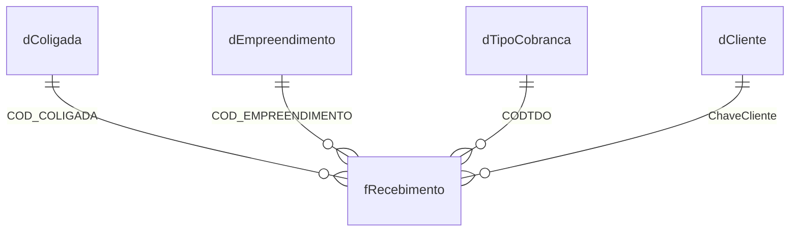

# Base de dados

A base do painel é formada por **5 arquivos CSV** em [`public/data/`](../public/data/). Todos os dados são **fictícios**.

---

## Modelo

A base segue o **modelo estrela**, comum em ferramentas de BI como o Power BI:

- **1 tabela fato** (`f...`): os acontecimentos que se quer medir, ou seja, as parcelas a receber.
- **4 tabelas dimensão** (`d...`): os cadastros que dão nome e contexto a esses acontecimentos.

_Leitura:_ uma coligada, um empreendimento, um tipo de cobrança ou um cliente podem ter **várias** parcelas, e cada parcela pertence a **um** de cada.

---

## Formato dos arquivos

| Regra | Exemplo |
|---|---|
| Separador de colunas: **vírgula** | `COD_COLIGADA,COLIGADA` |
| Primeira linha: **cabeçalho** com os nomes das colunas | |
| Codificação: **UTF-8**, para os acentos aparecerem corretamente | `Imobiliária` |
| Números com **ponto** decimal e sem separador de milhar | `2913.03` |
| Datas no formato **AAAA-MM-DD** | `2026-04-16` |
| Textos com vírgula devem ficar **entre aspas** | `"Silva, João"` |

---

## Tabelas

### `fRecebimento.csv`: parcelas a receber (fato)

| Coluna | Tipo | Descrição | Usada no painel |
|---|---|---|---|
| `ID_LAN` | número | **Identificador único** da parcela | ✅ |
| `NUM_VENDA` | número | Venda à qual a parcela pertence (uma venda tem várias parcelas) | ✅ |
| `NUM_DOCUMENTO` | texto | Número do documento, ex.: `DOC-6881`. Pode se repetir entre parcelas | ✅ busca e detalhes |
| `COD_COLIGADA` | número | Coligada → `dColigada` | ✅ filtro |
| `COD_EMPREENDIMENTO` | número | Empreendimento → `dEmpreendimento` | ✅ |
| `CODTDO` | número | Tipo de cobrança → `dTipoCobranca` | ✅ filtro |
| `ChaveCliente` | texto | Cliente → `dCliente` | ✅ |
| `DATAVENCIMENTO` | data | Data de vencimento | ✅ |
| `DATABAIXA` | data | Data do pagamento. **Vazia** se ainda não houve pagamento | ✅ |
| `VALOR_LIQUIDO` | número | Valor original da parcela | ✅ |
| `VALORBAIXA` | número | Valor já pago | ✅ |
| `SALDO` | número | Valor que falta pagar (`VALOR_LIQUIDO − VALORBAIXA`) | ✅ |
| `CM` | número | Correção monetária | ✅ valor atualizado |
| `STATUS_PAGAMENTO` | texto | `Baixado`, `Baixado parcialmente` ou `Em Aberto` | ✅ histórico |
| `DIAS_ATRASO` | número | Dias de atraso calculados na origem | ➖ ignorada, recalculada pelo painel |
| `FAIXA_ATRASO` | texto | Faixa de atraso calculada na origem | ➖ ignorada, recalculada pelo painel |
| `ENCARGOS` | número | Encargos calculados na origem | ➖ ignorada, o painel calcula o [valor atualizado](REGRAS_DE_NEGOCIO.md#valor-atualizado) |

> **Por que recalcular?** Dias e faixa de atraso dependem da data-base. Calcular no painel garante que todos os números usem a mesma data e as mesmas regras.

### `dCliente.csv`: clientes

| Coluna | Tipo | Descrição |
|---|---|---|
| `ChaveCliente` | texto | **Identificador único**, no formato `COD_COLCFO-COD_CLIENTE` (ex.: `3-1106`) |
| `COD_CLIENTE` | número | Código do cliente |
| `COD_COLCFO` | número | Código complementar que compõe a chave |
| `CLIENTE` | texto | Nome do cliente (pessoa ou empresa) |

### `dColigada.csv`: coligadas (empresas do grupo)

| Coluna | Tipo | Descrição |
|---|---|---|
| `COD_COLIGADA` | número | **Identificador único** |
| `COLIGADA` | texto | Nome da coligada |

### `dEmpreendimento.csv`: empreendimentos

| Coluna | Tipo | Descrição |
|---|---|---|
| `COD_EMPREENDIMENTO` | número | **Identificador único** |
| `NOME_EMPREENDIMENTO` | texto | Nome do empreendimento |

### `dTipoCobranca.csv`: tipos de cobrança

| Coluna | Tipo | Descrição |
|---|---|---|
| `CODTDO` | número | **Identificador único** |
| `TIPO_COBRANCA` | texto | Nome do tipo, ex.: `Aluguel`, `Venda` |

---

## Como trocar os dados

1. Substitua os arquivos em `public/data/`, **mantendo os mesmos nomes de arquivo e de colunas**. Colunas extras são ignoradas.
2. Publique a nova versão ou, localmente, recarregue a página.
3. Clique em **"Atualizar"** no painel.

> ⚠️ **Rodando localmente no Windows:** evite substituir os CSVs com o arquivo aberto no Excel. O Excel bloqueia o arquivo, e a cópia pode falhar.

### Validação automática

Ao carregar os dados, o painel confere cada arquivo. Se encontrar problema, mostra uma mensagem indicando **onde** está o erro:

| Problema | Mensagem de exemplo |
|---|---|
| Coluna obrigatória ausente | `dCliente.csv: coluna(s) ausente(s): ChaveCliente` |
| Número inválido | `Valor numérico inválido na coluna SALDO: "abc"` |
| Status desconhecido | `STATUS_PAGAMENTO desconhecido: "Pago"` |
| Arquivo não encontrado | `Arquivo de dados não encontrado: fRecebimento.csv` |

### Onde está o código

| O que | Arquivo |
|---|---|
| Lista de arquivos e conversão das colunas | [`src/data/database.ts`](../src/data/database.ts) |
| Download e cópia salva no navegador | [`src/data/snapshot.ts`](../src/data/snapshot.ts) |
| Tipos das tabelas | [`src/types/database.ts`](../src/types/database.ts) |

**Para adicionar uma coluna nova ao painel:** inclua o campo no tipo em `src/types/database.ts`, converta a coluna em `parseDatabase()` (`src/data/database.ts`) e use o campo nos services.
